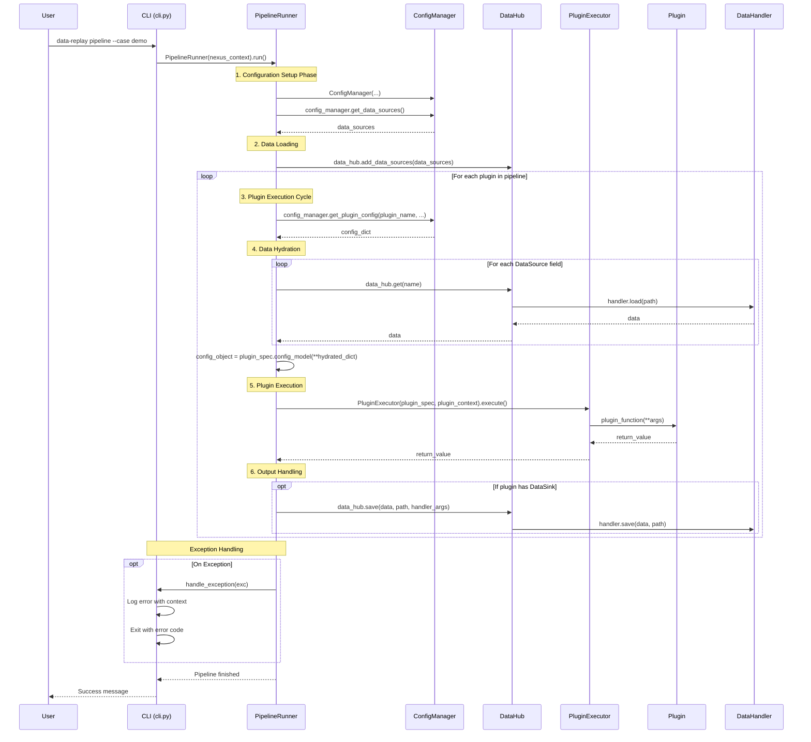

# Data Replay & Processing Framework

[](https://github.com/your-repo/nexus)

A flexible, configuration-driven Python framework for building robust, extensible, and maintainable data processing pipelines. It is designed from the ground up with a focus on dependency injection, automatic discovery, and a declarative workflow.

## Key Features

- **Declarative Pipelines**: Define complex, multi-stage workflows in simple and readable `YAML` files.
- **Functional & Pluggable**: Write plugins as simple, decorated Python functions (`@plugin`). No boilerplate classes needed.
- **Declarative I/O**: Use `DataSource` and `DataSink` annotations in Pydantic configuration models to declare data dependencies.
- **Automatic Dependency Injection**: Framework services (`DataHub`, `Logger`), data objects, paths, and configuration parameters are automatically injected into your plugin functions based on type hints and parameter names.
- **Centralized Data Management**: A powerful `DataHub` manages the lifecycle of all data, providing lazy loading and automatic I/O handling.
- **Extensible I/O Handlers**: Add support for new data formats by creating simple, decorated `DataHandler` classes (`@handler`).
- **Hierarchical Configuration**: A multi-layered configuration system (Plugin Default < Global < Case < CLI) provides maximum flexibility and reusability.
- **Automatic Discovery**: Plugins and Handlers are discovered automatically by the framework. No manual registration required.
- **Auto-Generated Documentation**: A command-line tool to generate a complete reference for all plugins and handlers.
- **Pure-function Plugins**: Plugins are designed as pure data transformation functions that receive inputs via a config object and return a result.
- **Minimal Plugin Signature**: Plugins require a minimal function signature (e.g., `(config, logger)`), with a single, defined return value if output is needed.

## Project Structure

```
.
├── cases/                # Contains different data processing cases (e.g., demo).
├── config/               # Global framework configuration.
├── docs/                 # Documentation files
│   └── REFERENCE.md      # Auto-generated reference for all plugins and handlers.
├── logs/                 # Directory for log files.
├── src/
│   └── nexus/            # Core framework source code.
│       ├── __init__.py
│       ├── cli.py        # Command-line interface
│       ├── core/         # Core framework modules
│       │   ├── config/
│       │   ├── data/
│       │   ├── di/
│       │   ├── plugin/
│       │   └── ...
│       ├── plugins/      # Built-in plugins (part of framework package)
│       │   ├── __init__.py
│       │   ├── prediction/    # Prediction plugins
│       │   └── visualization/ # Visualization plugins
│       └── handlers/     # Built-in data handlers (part of framework package)
│           ├── __init__.py
│           └── ...        # Handler implementations
├── templates/            # Templates for generating new cases.
├── tests/
├── .gitignore
├── README.md
└── pyproject.toml        # Project configuration and dependencies.
```

## Getting Started

### Prerequisites
- Python 3.10+

### Installation

1. Clone the repository:
   ```bash
   git clone <your-repo-url>
   cd <repository-name>
   ```

2. Install the project in editable mode. This will install all dependencies and make the `data-replay` command available in your environment.
   ```bash
   pip install -e .
   ```

## Usage: The Unified CLI

All interactions with the framework are handled through the central `data-replay` command.

### 1. Generate Demo Data

First, generate the sample data required to run the demo case.

```bash
data-replay generate-data
```

### 2. Run a Pipeline

Execute the entire pipeline for a given case. 

```bash
# Run the demo pipeline
data-replay pipeline --case demo
```

### 3. Run a Single Plugin

Execute a specific plugin from a case definition. This is useful for debugging or testing individual components. The framework will set up the full context required to run just that plugin.

```bash
# Example: Run only the "Frame Renderer" plugin for the demo case
data-replay plugin "Latency Compensator" --case demo
data-replay plugin "Frame Renderer" --case demo
data-replay plugin "Video Creator" --case demo
```

### 4. Generate Documentation

Scan all registered plugins and handlers and generate the `REFERENCE.md` file in the `docs/` directory.

```bash
data-replay docs
```

## Testing

The project includes a robust end-to-end test suite built with `pytest` to ensure all core functionalities are working as expected. These tests cover data generation, full pipeline execution, individual plugin runs, and documentation generation.

To run the entire test suite, navigate to the project root and execute:

```bash
pytest tests/e2e_test.py
```

This will automatically generate necessary demo data and clean up the environment before and after the tests.

## Core Concepts

### Declarative I/O with DataSource and DataSink

The framework uses a declarative approach for input and output management through `DataSource` and `DataSink` annotations in plugin configuration models. These annotations use logical names instead of physical paths, allowing the same plugin to be reused across different cases by simply re-wiring its inputs and outputs in the `case.yaml` file.

```python
from pydantic import BaseModel
from typing import Annotated, Optional
from nexus.core.plugin.typing import DataSource, DataSink

class MyPluginConfig(BaseModel):
    model_config = {"arbitrary_types_allowed": True}
    
    # Input: The framework will discover this, load the CSV, and inject a DataFrame.
    measurements: Annotated[
        pd.DataFrame,
        DataSource(name="latent_measurements")
    ]

    # Output: The framework will take the returned DataFrame and save it to this path.
    # This is marked as Optional because it's not an input; the framework handles it post-execution.
    predicted_states: Optional[Annotated[
        pd.DataFrame,
        DataSink(name="predicted_states")
    ]] = None

    # Algorithm Parameters
    latency_to_compensate_s: float = 0.2
```

### `case.yaml`

This file is the heart of a pipeline run. It defines two key sections:

- **`io_mapping`**: A mapping of logical I/O names used by plugins to physical file paths and handlers. This allows the same plugin to be reused across different cases by simply re-wiring its inputs and outputs here.
- **`pipeline`**: A list of the plugins (the "verbs") to execute in sequence. You can enable/disable plugins and override their default parameters here.

*Example snippet from `cases/demo/case.yaml`.*
```yaml
io_mapping:
  # --- For LatencyCompensator ---
  latent_measurements:
    path: "raw_data/latent_measurements.csv"
    handler: "csv"
  predicted_states:
    path: "intermediate/predicted_states.parquet"
    handler: "parquet"

  # --- For FrameRenderer ---
  video_manifest:
    path: "raw_data/video_manifest.csv"
    handler: "csv"
  # FrameRenderer's output is the input for VideoCreator
  rendered_frames:
    path: "intermediate/rendered_frames"
    handler: "dir" # Assuming a 'dir' handler that provides the path

pipeline:
  # The first plugin in the demo compensates for latency.
  - plugin: "Latency Compensator"
    config:
      latency_to_compensate_s: 0.2

  # The next plugin renders the results into image frames.
  - plugin: "Frame Renderer"
    config:
      zoom_factor: 5
```

### Exception Handling

The framework implements a comprehensive exception handling system with a well-defined exception hierarchy. This system provides structured error reporting and contextual information to aid in debugging and troubleshooting.

Key features of the exception handling system:

1. **Structured Exception Hierarchy**: Custom exceptions are organized in a logical hierarchy, making it easy to catch and handle specific types of errors.
2. **Contextual Information**: All exceptions include contextual information such as timestamps, related resources, and operation details.
3. **Global Exception Handler**: A centralized exception handler provides consistent error reporting across the framework.
4. **Detailed Logging**: Exceptions are automatically logged with appropriate severity levels and detailed information.

Example exception hierarchy:
```
BaseFrameworkException
├── ConfigurationException
├── DataException
├── PluginException
├── ValidationException
└── FrameworkException
```

### Plugins (`@plugin`)
A plugin is a simple Python function decorated with `@plugin`. It defines the logic for a single processing step. Its parameters are automatically supplied by the dependency injection system.

Plugins should be designed as pure data transformation functions that:
1. Receive inputs via a config object
2. Return a result if output is needed
3. Separate themselves from I/O operations

*Example Plugin Signature:*
```python
from nexus.core.plugin.decorator import plugin
from logging import Logger
import pandas as pd
from .config import MyPluginConfig

@plugin(
    name="My Awesome Plugin",
    default_config=MyPluginConfig
)
def my_plugin(config: MyPluginConfig, logger: Logger) -> pd.DataFrame:
    """Plugin docstring."""
    # The 'measurements' field in the config is a ready-to-use DataFrame.
    df = config.measurements.copy()
    
    # ... your logic here ...
    logger.info(f"Processing with latency_to_compensate_s = {config.latency_to_compensate_s}")
    
    # The return value will be automatically saved to the DataSink path
    return processed_df
```

### Handlers (`@handler`)
A Handler is a class decorated with `@handler` that teaches the `DataHub` how to read and write a specific data format (e.g., `.csv`, `.parquet`, `.json`). The framework automatically discovers them, making it easy to add support for new file types.

### Architecture Overview

The framework follows a plugin-based architecture with automatic dependency injection:

1. **PipelineRunner**: The core engine that orchestrates the entire run in a multi-stage process:
    - **Dependency Discovery**: Pre-scans active plugins to discover all `DataSource` and `DataSink` declarations.
    - **Configuration & Data Loading**: Merges all configuration layers and loads all required data specified by `DataSource` annotations. The `io_mapping` section in `case.yaml` is used to resolve logical names to physical paths and handlers.
    - **Configuration Hydration**: Replaces any `DataSource` annotated fields with the actual data loaded from the `DataHub`.
    - **Execution**: Passes the fully "hydrated" and type-safe config object to the `PluginExecutor` for execution.
    - **Result Handling**: After the plugin executes, writes the plugin's return value to the destination specified by the `DataSink`. The `io_mapping` section in `case.yaml` is used to resolve logical names to physical paths and handlers.

2. **PluginExecutor**: Receives a fully prepared `PluginContext`, executes the plugin function, and returns the result.

3. **DataHub**: The central data exchange component that manages the lifecycle of all data, providing lazy loading and automatic I/O handling.

4. **ConfigManager**: A stateless configuration calculator that merges configuration from multiple layers.

## Framework Execution Flow (Code Level)

To understand how the framework works at a code level, let's trace the execution flow from the CLI command to the final plugin execution.

### 1. CLI Entry Point (`cli.py`)

When you run a command like `data-replay pipeline --case demo`, the execution starts in `cli.py`:

```python
@app.command()
def pipeline(
    case: str = typer.Option(..., "--case", help="Name of the case directory under 'cases/' (e.g., 'demo')"),
):
    # 1. Load global configuration
    global_config = load_yaml(project_root / "config" / "global.yaml")
    
    # 2. Resolve case path
    cases_root_str = global_config.get("cases_root", "cases")
    cases_root = Path(cases_root_str)
    # ... path resolution logic ...
    
    # 3. Create core components
    data_hub = DataHub(case_path=case_path, logger=logger)
    run_config = {
        "cli_args": {},
        "plugin_modules": global_config.get("plugin_modules", [])
    }
    
    # 4. Create execution context
    nexus_context = NexusContext(
        project_root=project_root,
        cases_root=cases_root,
        case_path=case_path,
        data_hub=data_hub,
        logger=logger,
        run_config=run_config
    )
    
    # 5. Run the pipeline
    try:
        runner = PipelineRunner(nexus_context)
        runner.run()  # This is where the magic happens
        logger.info(f"====== Case '{case_path.name}' finished successfully. ======")
    except Exception as e:
        logger.critical(f"A critical error occurred during pipeline execution: {e}", exc_info=True)
        raise typer.Exit(code=1)
```

### 2. Pipeline Runner (`pipeline_runner.py`)

The `PipelineRunner.run()` method is the core of the framework execution:

```python
def run(self) -> None:
    # --- 1. Configuration Setup Phase ---
    # Load global and case configurations
    global_config_path = self._context.project_root / "config" / "global.yaml"
    global_config = load_yaml(global_config_path)
    case_config = load_yaml(self._context.case_path / "case.yaml")
    pipeline_steps = case_config.get("pipeline", [])

    # --- 1a. Dependency Discovery Phase ---
    # Discover all DataSource and DataSink declarations from plugins
    discovered_sources, plugin_sources, plugin_sinks = self._discover_io_declarations(pipeline_steps, case_config)

    # --- 1b. Config Merging ---
    # Create ConfigManager to handle configuration hierarchy
    config_manager = ConfigManager(
        global_config=global_config, case_config=case_config,
        plugin_registry=PLUGIN_REGISTRY, discovered_data_sources=discovered_sources,
        case_path=self._context.case_path, project_root=self._context.project_root,
        cli_args=self._context.run_config.get('cli_args', {})
    )

    # --- 1c. Data Loading ---
    # Load all data sources into DataHub
    final_data_sources = config_manager.get_data_sources()
    self._context.data_hub.add_data_sources(final_data_sources)
    self._logger.info(f"DataHub initialized with {len(final_data_sources)} merged data sources.")

    # --- 2. Execution Phase ---
    for step_config in pipeline_steps:
        plugin_name = step_config.get("plugin")
        # ... plugin filtering logic ...

        # --- 2a. Get Raw Config & Hydrate ---
        # Get plugin configuration and hydrate with actual data
        config_dict = config_manager.get_plugin_config(
            plugin_name=plugin_name, case_plugin_config=case_plugin_params
        )

        hydrated_dict = config_dict.copy()
        sources_for_plugin = plugin_sources.get(plugin_name, {})
        for field_name, source_marker in sources_for_plugin.items():
            # The name used here must match the one used in discovery
            name = source_marker.name
            self._logger.debug(f"Hydrating field '{field_name}' with data source '{name}'.")
            hydrated_dict[field_name] = self._context.data_hub.get(name)  # Lazy loading happens here

        # --- 2b. Validate and Instantiate Pydantic Model ---
        try:
            config_object = plugin_spec.config_model(**hydrated_dict)
            self._logger.debug(f"Successfully created config object for {plugin_name}")
        except Exception as e:
            self._logger.error(f"Configuration validation failed for plugin '{plugin_name}': {e}")
            raise

        # --- 2c. Execute Plugin ---
        plugin_context = PluginContext(
            data_hub=self._context.data_hub, logger=self._context.logger,
            project_root=self._context.project_root, case_path=self._context.case_path,
            config=config_object
        )

        try:
            executor = PluginExecutor(plugin_spec, plugin_context)
            return_value = executor.execute()
        except Exception:
            self._logger.critical(f"A critical error occurred in plugin '{plugin_name}'. Halting pipeline.", exc_info=True)
            raise

        # --- 2d. Handle Output ---
        sinks_for_plugin = plugin_sinks.get(plugin_name, {})
        if not sinks_for_plugin:
            if return_value is not None:
                self._logger.debug(f"Plugin '{plugin_name}' returned a value but has no DataSink declared.")
            continue

        # Get the first (and only) sink
        sink_field, sink_marker = list(sinks_for_plugin.items())[0]

        if return_value is None:
            self._logger.warning(f"Plugin '{plugin_name}' has a DataSink for field '{sink_field}' but returned None.")
            continue

        self._logger.info(f"Plugin '{plugin_name}' produced output. Writing to sink: {sink_marker.name}")
        try:
            # We need to resolve the path relative to the case directory
            # Get the io_mapping from case_config
            io_mapping = case_config.get("io_mapping", {})
            sink_config = io_mapping.get(sink_marker.name, {})
            output_path_str = sink_config.get("path", "")
            output_path = self._context.case_path / output_path_str
            handler_args = sink_config.get("handler_args", sink_marker.handler_args)
            self._context.data_hub.save(
                data=return_value,
                path=output_path,
                handler_args=handler_args
            )
            self._logger.debug(f"Successfully wrote output to {output_path}")
        except Exception as e:
            self._logger.error(f"Failed to write output for plugin '{plugin_name}' to {sink_marker.path}: {e}", exc_info=True)
            raise

    self._logger.info("Pipeline run finished successfully.")
```

### 3. IO Declaration Discovery (`pipeline_runner.py`)

The `_discover_io_declarations` method scans plugins for DataSource and DataSink annotations:

```python
def _discover_io_declarations(self, pipeline_steps: List[Dict[str, Any]], case_config: dict) -> Tuple[Dict[str, Any], Dict[str, Dict[str, DataSource]], Dict[str, Dict[str, DataSink]]]:
    base_data_sources = {}
    plugin_sources = {}
    plugin_sinks = {}

    # Get io_mapping from case_config
    io_mapping = case_config.get("io_mapping", {})

    for step_config in pipeline_steps:
        plugin_name = step_config.get("plugin")
        # ... plugin filtering logic ...

        plugin_spec = PLUGIN_REGISTRY[plugin_name]
        if not plugin_spec.config_model:
            continue

        plugin_sources[plugin_name] = {}
        plugin_sinks[plugin_name] = {}

        try:
            # Use get_type_hints to correctly resolve forward references
            type_hints = get_type_hints(plugin_spec.config_model, include_extras=True)
        except (NameError, TypeError) as e:
            self._logger.error(f"Could not resolve type hints for {plugin_name}'s config: {e}")
            continue

        for field_name, field_type in type_hints.items:
            # Handle Union types (like Optional[Annotated[...]])
            field_args = get_args(field_type)
            # If it's a Union, we need to check the first argument (the Annotated type)
            if field_args and get_origin(field_type) is Union:
                # Check if the first argument is Annotated
                if get_origin(field_args[0]) is Annotated:
                    field_metadata = get_args(field_args[0])[1:]  # Skip the actual type, get metadata
                else:
                    continue
            # Handle direct Annotated types
            elif get_origin(field_type) is Annotated:
                field_metadata = get_args(field_type)[1:]  # Skip the actual type, get metadata
            else:
                continue

            for item in field_metadata:
                if isinstance(item, DataSource):
                    # For ConfigManager (name -> path/handler mapping)
                    # Note: We need a unique name. For now, let's use the name attribute.
                    name = item.name
                    if name in base_data_sources:
                        self._logger.warning(f"Data source name '{name}' is declared by multiple plugins.")
                    
                    # Get path and handler from io_mapping
                    source_config = io_mapping.get(name, {})
                    path = source_config.get("path", "")
                    handler = source_config.get("handler", "")
                    
                    # Build handler_args
                    handler_args = item.handler_args.copy() if item.handler_args else {}
                    if handler:
                        handler_args["name"] = handler
                    
                    base_data_sources[name] = {
                        "path": path,
                        "handler_args": handler_args
                    }
                    # For runner (plugin -> field -> DataSource mapping)
                    plugin_sources[plugin_name][field_name] = item

                elif isinstance(item, DataSink):
                    plugin_sinks[plugin_name][field_name] = item

    if base_data_sources:
        self._logger.info(f"Discovered {len(base_data_sources)} data sources from plugin configs.")
    return base_data_sources, plugin_sources, plugin_sinks
```

### 4. Data Hub (`data/hub.py`)

The DataHub is responsible for lazy loading and saving data:

```python
def get(self, name: str) -> Any:
    """
    Retrieves data from the Hub, lazy-loading if necessary.
    """
    if name in self._data:
        logger.debug(f"Getting data '{name}' from memory.")
        return self._data[name]
    
    if name in self._registry:
        source = self._registry[name]
        path = source.path
        must_exist = source.handler_config.get("must_exist", True)

        logger.info(f"Lazy loading data '{name}' from: {path}...")
        
        try:
            handler = self._get_handler_instance(source)
            # For directory handlers, we don't check must_exist before calling load
            # because the handler itself will create the directory if needed
            if must_exist and not path.exists() and not getattr(handler, 'handles_directories', False):
                raise FileNotFoundError(f"Required file for data source '{name}' not found at: {path}")

            data = handler.load(path)  # Actual data loading happens here
            self._data[name] = data
            return data
        except Exception as e:
            logger.error(f"Failed to load data '{name}' from {path}: {e}")
            raise
        
    raise KeyError(f"Data '{name}' not found in DataHub.")
```

### 5. Plugin Executor (`plugin/executor.py`)

The PluginExecutor executes the plugin function with the prepared context:

```python
def execute(self) -> Any:
    """
    Executes the plugin function with the prepared context and returns its result.
    """
    self._context.logger.info(f"Executing plugin: '{self._spec.name}'")

    # 1. Prepare arguments based on standard signatures
    args_to_inject = self._prepare_arguments()

    # 2. Execute the plugin function
    try:
        return_value = self._func(**args_to_inject)
        self._context.logger.info(f"Plugin '{self._spec.name}' executed successfully.")
        return return_value
    except Exception as e:
        self._context.logger.error(
            f"Error executing plugin '{self._spec.name}': {e}",
            exc_info=True
        )
        raise

def _prepare_arguments(self) -> dict[str, Any]:
    """
    Prepares the arguments for the plugin function based on its signature.
    """
    args_to_inject = {}
    signature = inspect.signature(self._func)
    params = signature.parameters

    # A simple injection mechanism for a standardized signature
    if "config" in params:
        args_to_inject["config"] = self._context.config
    if "logger" in params:
        args_to_inject["logger"] = self._context.logger
    if "context" in params:
        args_to_inject["context"] = self._context
    
    # ... more injection logic ...

    return args_to_inject
```

### Execution Flow Diagram



This detailed walkthrough shows how the framework executes from the CLI entry point through all the core components to finally execute the user's plugins with their data dependencies automatically resolved and injected.

# Framework Execution Flow (Detailed Code-Level Analysis)

本文档将帮助您从代码层面理解 Nexus Framework 的运行流程。

## 1. 整体架构

Nexus Framework 采用插件化架构，核心组件包括：

- **CLI (Command Line Interface)**: 用户入口点
- **PipelineRunner**: 核心执行引擎
- **ConfigManager**: 配置管理器
- **DataHub**: 数据中心
- **Plugin System**: 插件系统
- **Dependency Injection**: 依赖注入系统

## 2. 运行流程详解

### 2.1 CLI 命令处理流程

当用户执行命令时，程序从 `src/nexus/cli.py` 开始：

```python
# cli.py
@app.command()
def pipeline(
    case: str = typer.Option(..., "--case", help="Name of the case directory under 'cases/' (e.g., 'demo')"),
):
    # 1. 加载全局配置
    global_config = load_yaml(project_root / "config" / "global.yaml")
    
    # 2. 解析案例路径
    cases_root_str = global_config.get("cases_root", "cases")
    cases_root = Path(cases_root_str)
    case_path = resolve_case_path(cases_root, case)
    
    # 3. 创建核心上下文
    nexus_context = NexusContext(
        project_root=project_root,
        case_path=case_path,
        data_hub=None,  # 稍后设置
        logger=logger,
        run_config=run_config
    )
    
    # 4. 创建 DataHub
    data_hub = DataHub(case_path=case_path, logger=logger, context=nexus_context)
    nexus_context.data_hub = data_hub
    
    # 5. 创建并运行 PipelineRunner
    try:
        from nexus.core.pipeline_runner_factory import PipelineRunnerFactory
        runner = PipelineRunnerFactory.create(nexus_context)
        runner.run()
        logger.info(f"====== Case '{case_path.name}' finished successfully. ======")
    except NexusError as e:
        handle_exception(e)
        raise typer.Exit(code=1)
```

### 2.2 PipelineRunner 执行流程

`PipelineRunner` 是框架的核心执行引擎，位于 `src/nexus/core/pipeline_runner.py`：

```python
# pipeline_runner.py
class PipelineRunner:
    def __init__(self, context: NexusContext):
        self._context = context
        # 使用 DI 容器获取 logger（如果可用）
        try:
            self._logger = container.resolve(LoggerInterface)
        except ServiceNotFoundError:
            self._logger = context.logger
        # 发现插件
        discover_plugins(plugin_modules, self._logger, self._context.project_root)
    
    def run(self, plugin_name: str | None = None) -> None:
        # 1. 配置设置阶段
        raw_case_config = load_yaml(self._context.case_path / "case.yaml")
        pipeline_steps = raw_case_config.get("pipeline", [])
        
        # 2. 依赖发现阶段
        discovered_sources, plugin_sources, plugin_sinks = self._discover_io_declarations(pipeline_steps, raw_case_config)
        
        # 3. 配置合并
        config_manager = ConfigManager.from_sources(
            project_root=self._context.project_root,
            case_path=self._context.case_path,
            plugin_registry=PLUGIN_REGISTRY,
            discovered_data_sources=discovered_sources,
            cli_args=self._context.run_config.get('cli_args', {})
        )
        
        # 4. 数据加载和预检类型检查
        final_data_sources = config_manager.get_data_sources()
        self._context.data_hub.add_data_sources(final_data_sources)
        
        # 5. 执行阶段
        for step_config in pipeline_steps:
            self._execute_plugin_step(step_config, plugin_sources, plugin_sinks, config_manager, raw_case_config)
```

### 2.3 依赖发现流程

`_discover_io_declarations` 方法负责发现插件的输入输出依赖：

```python
def _discover_io_declarations(self, pipeline_steps: List[Dict[str, Any]], case_config: dict) -> Tuple[Dict[str, Any], Dict[str, Dict[str, DataSource]], Dict[str, Dict[str, DataSink]]]:
    base_data_sources = {}
    plugin_sources = {}
    plugin_sinks = {}
    
    io_mapping = case_config.get("io_mapping", {})
    
    for step_config in pipeline_steps:
        plugin_name = step_config.get("plugin")
        if not plugin_name or plugin_name not in PLUGIN_REGISTRY or not step_config.get("enable", True):
            continue
            
        plugin_spec = PLUGIN_REGISTRY[plugin_name]
        if not plugin_spec.config_model:
            continue
            
        plugin_sources[plugin_name] = {}
        plugin_sinks[plugin_name] = {}
        
        # 使用 get_type_hints 正确解析类型提示
        type_hints = get_type_hints(plugin_spec.config_model, include_extras=True)
        
        for field_name, field_type in type_hints.items():
            # 处理联合类型（如 Optional[Annotated[...]]）
            field_args = get_args(field_type)
            if field_args and get_origin(field_type) is Union:
                if get_origin(field_args[0]) is Annotated:
                    field_metadata = get_args(field_args[0])[1:]  # 跳过实际类型，获取元数据
                    actual_type = get_args(field_args[0])[0]
                else:
                    continue
            # 处理直接注解类型
            elif get_origin(field_type) is Annotated:
                field_metadata = get_args(field_type)[1:]  # 跳过实际类型，获取元数据
                actual_type = get_args(field_type)[0]
            else:
                continue
                
            for item in field_metadata:
                if isinstance(item, DataSource):
                    # 对于 ConfigManager（name -> path/handler 映射）
                    name = item.name
                    # 从 io_mapping 获取路径和处理器
                    source_config = io_mapping.get(name, {})
                    path = source_config.get("path", "")
                    handler = source_config.get("handler", "")
                    
                    # 构建 handler_args
                    handler_args = item.handler_args.copy() if item.handler_args else {}
                    if handler:
                        handler_args["name"] = handler
                    
                    base_data_sources[name] = {
                        "path": path,
                        "handler_args": handler_args,
                        "expected_type": actual_type  # 存储预期类型用于预检检查
                    }
                    # 对于 runner（plugin -> field -> DataSource 映射）
                    plugin_sources[plugin_name][field_name] = item
                    
                elif isinstance(item, DataSink):
                    plugin_sinks[plugin_name][field_name] = item
                    
    return base_data_sources, plugin_sources, plugin_sinks
```

### 2.4 配置管理流程

`ConfigManager` 负责配置的加载和合并，位于 `src/nexus/core/config/manager.py`：

```python
# manager.py
class ConfigManager:
    def __init__(self, *,
                 global_config: Dict,
                 case_config: Dict,
                 cli_args: Dict,
                 plugin_registry: Dict[str, PluginSpec],
                 discovered_data_sources: Dict,
                 case_path: Path,
                 project_root: Path):
        self.global_config = global_config
        self.case_config = case_config
        self.cli_args = cli_args
        self.discovered_data_sources = discovered_data_sources
        self.case_path = case_path
        self.project_root = project_root
        self.plugin_defaults_map = self._extract_plugin_defaults(plugin_registry)
        
        self._merged_data_sources = self._merge_all_data_sources()
        
    @classmethod
    def from_sources(cls, *,
                     project_root: Path,
                     case_path: Path,
                     plugin_registry: Dict[str, PluginSpec],
                     discovered_data_sources: Dict,
                     cli_args: Dict = None) -> 'ConfigManager':
        """
        工厂方法，从所有源加载创建 ConfigManager。
        优先级：CLI > Case > Global > Environment > Defaults。
        """
        cli_args = cli_args or {}
        
        # 1. 从文件和环境加载配置
        global_config_path = project_root / "config" / "global.yaml"
        case_config_path = case_path / "case.yaml"
        
        global_conf = _load_yaml(global_config_path)
        case_conf = _load_yaml(case_config_path)
        env_conf = cls._load_environment_config()
        
        # 2. 合并全局、环境和案例配置
        # Env 覆盖 global，case 覆盖 env。
        merged_global = _deep_merge(global_conf, env_conf)
        final_case_config = _deep_merge(merged_global, case_conf)
        
        return cls(
            global_config=merged_global,
            case_config=final_case_config,
            cli_args=cli_args,
            plugin_registry=plugin_registry,
            discovered_data_sources=discovered_data_sources,
            case_path=case_path,
            project_root=project_root
        )
```

### 2.5 插件执行流程

插件执行由 `PluginExecutor` 处理，位于 `src/nexus/core/plugin/executor.py`：

```python
# executor.py
class PluginExecutor:
    def __init__(self, plugin_spec: PluginSpec, context: PluginContext):
        self._spec = plugin_spec
        self._context = context
        self._func = plugin_spec.func
        
    def execute(self) -> Any:
        """
        使用准备好的上下文执行插件函数并返回其结果。
        """
        self._context.logger.info(f"Executing plugin: '{self._spec.name}'")
        
        # 1. 根据函数签名准备参数
        args_to_inject = self._prepare_arguments()
        
        # 2. 执行插件函数
        try:
            return_value = self._func(**args_to_inject)
            self._context.logger.info(f"Plugin '{self._spec.name}' executed successfully.")
            return return_value
        except Exception as e:
            self._context.logger.error(
                f"Error executing plugin '{self._spec.name}': {e}",
                exc_info=True
            )
            raise
            
    def _prepare_arguments(self) -> dict[str, Any]:
        """
        根据插件函数签名准备参数。
        支持新的 PluginContext 签名和旧的签名以保持向后兼容性。
        """
        args_to_inject = {}
        signature = inspect.signature(self._func)
        params = signature.parameters
        
        # 检查插件是否使用新的 PluginContext 签名
        if len(params) == 1 and "context" in params:
            # 新签名：def plugin_function(context: PluginContext)
            args_to_inject["context"] = self._context
        else:
            # 旧签名支持：def plugin_function(config, logger)
            if "config" in params:
                args_to_inject["config"] = self._context.config
            if "logger" in params:
                args_to_inject["logger"] = self._context.logger
            if "context" in params:
                args_to_inject["context"] = self._context
                
            # 如果使用旧签名则警告
            if len(params) > 0:
                self._context.logger.warning(
                    f"Plugin '{self._spec.name}' uses legacy signature: {signature}. "
                    f"Consider updating to the new PluginContext signature: (context: PluginContext)"
                )
                
        return args_to_inject
```

### 2.6 数据处理流程

`DataHub` 是数据处理的核心，位于 `src/nexus/core/data/hub.py`：

```python
# hub.py
class DataHub:
    def __init__(self, case_path: Path, logger: Logger = None, context=None):
        self._case_path = case_path
        self._data: Dict[str, Any] = {}
        self._registry: Dict[str, DataSource] = {}
        self.logger = logger if logger else logging.getLogger(__name__)
        
        # 初始化处理器发现
        initialize_handler_discovery(context)
        
    def get(self, name: str) -> Any:
        """
        从 Hub 检索数据，必要时进行懒加载。
        """
        if name in self._data:
            logger.debug(f"Getting data '{name}' from memory.")
            return self._data[name]
            
        if name in self._registry:
            source = self._registry[name]
            path = source.path
            must_exist = source.handler_config.get("must_exist", True)
            
            logger.info(f"Lazy loading data '{name}' from: {path}...")
            
            try:
                handler = self._get_handler_instance(source)
                # 对于目录处理器，我们在调用 load 之前不检查 must_exist
                # 因为处理器本身会在需要时创建目录
                if must_exist and not path.exists() and not getattr(handler, 'handles_directories', False):
                    raise FileNotFoundError(f"Required file for data source '{name}' not found at: {path}")
                    
                data = handler.load(path)
                self._data[name] = data
                return data
            except Exception as e:
                error_context = {
                    "data_source_name": name,
                    "path": str(path),
                    "must_exist": must_exist
                }
                exc = NexusError(
                    f"Failed to load data '{name}' from {path}: {e}",
                    context=error_context,
                    cause=e
                )
                handle_exception(exc, error_context)
                raise exc
                
        raise KeyError(f"Data '{name}' not found in DataHub.")
```

## 3. 关键设计模式

### 3.1 依赖注入 (Dependency Injection)

框架使用依赖注入来管理服务：

```python
# container.py
class DIContainer:
    def register(
        self,
        service_type: Type,
        implementation: Any = None,
        lifecycle: str = ServiceLifeCycle.SINGLETON,
        factory: Optional[Callable] = None
    ) -> None:
        # 注册服务
        
    def resolve(self, service_type: Type) -> Any:
        # 解析服务
```

### 3.2 插件系统

插件通过装饰器注册：

```python
# decorator.py
def plugin(*, name: str, output_key: str | None = None, default_config: Type[BaseModel] | None = None):
    def decorator(func: Callable):
        spec = PluginSpec(
            name=name,
            func=func,
            output_key=output_key,
            config_model=default_config
        )
        
        if name in PLUGIN_REGISTRY:
            raise ValueError(f"Plugin with name '{name}' is already registered.")
            
        PLUGIN_REGISTRY[name] = spec
        return wrapper
    return decorator
```

### 3.3 数据处理器模式

数据处理器通过装饰器注册：

```python
# handlers/decorator.py
def handler(*, name: str, handles_extension: str = None, produced_type: Type = None):
    def decorator(cls: Type[DataHandler]):
        if name:
            HANDLER_REGISTRY[name] = cls
        if handles_extension:
            HANDLER_REGISTRY[handles_extension] = cls
            
        # 设置处理器属性
        cls.produced_type = produced_type
        return cls
    return decorator
```

## 4. 异常处理机制

框架采用分层异常处理：

```python
# exceptions.py
class NexusError(Exception):
    def __init__(
        self, 
        message: str, 
        context: Optional[Dict[str, Any]] = None,
        cause: Optional[Exception] = None
    ):
        super().__init__(message)
        self.message = message
        self.context = context or {}
        self.cause = cause
        
class ConfigurationError(NexusError):
    """配置错误"""
    pass
    
class PluginError(NexusError):
    """插件错误"""
    pass
```

全局异常处理器：

```python
# exception_handler.py
class GlobalExceptionHandler:
    def handle_exception(self, exc: Exception, context: Optional[dict] = None) -> None:
        if isinstance(exc, NexusError) and context:
            exc.context.update(context)
            
        if isinstance(exc, ConfigurationError):
            self.logger.error(f"Configuration error: {exc}", exc_info=False)
        elif isinstance(exc, PluginError):
            self.logger.error(f"Plugin error: {exc}", exc_info=True)
        elif isinstance(exc, NexusError):
            self.logger.error(f"Framework error: {exc}", exc_info=True)
        else:
            self._handle_generic_exception(exc)
```

## 5. 运行时流程图

